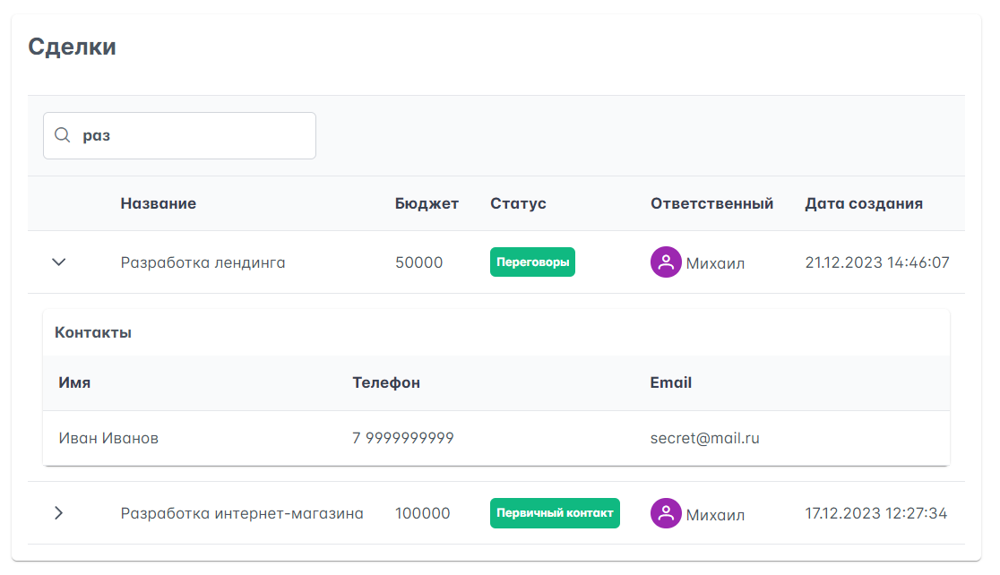
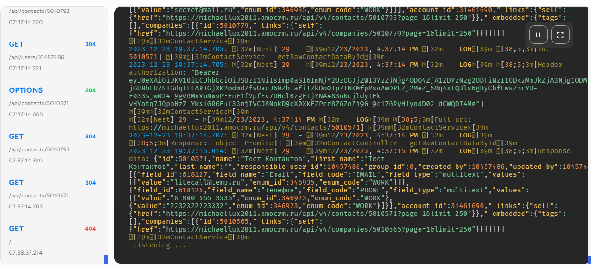

# RocketTestProject [](https://app.codacy.com/gh/michaellux/RocketTestProject/dashboard?utm_source=gh&utm_medium=referral&utm_content=&utm_campaign=Badge_grade)




Frontend: https://rocket-test-project-web.vercel.app/

Backend: [https://combative-stockings-clam.cyclic.app/](https://combative-stockings-clam.cyclic.app/api/leads)

## Установка локальная

```bash
# В папках apps/api, apps/web + в корне проекта 
$ npm install
```

## Запуск

```bash
# В корне проекта
$ npm run dev
```
Для локального запуска необходимо поменять настройки редиректа.

